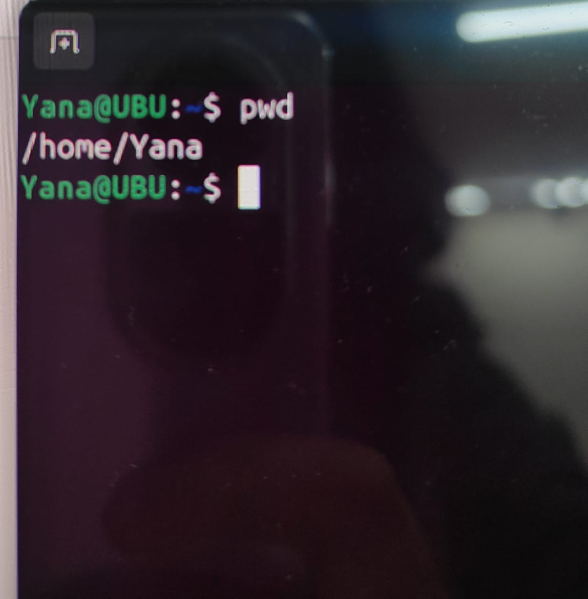
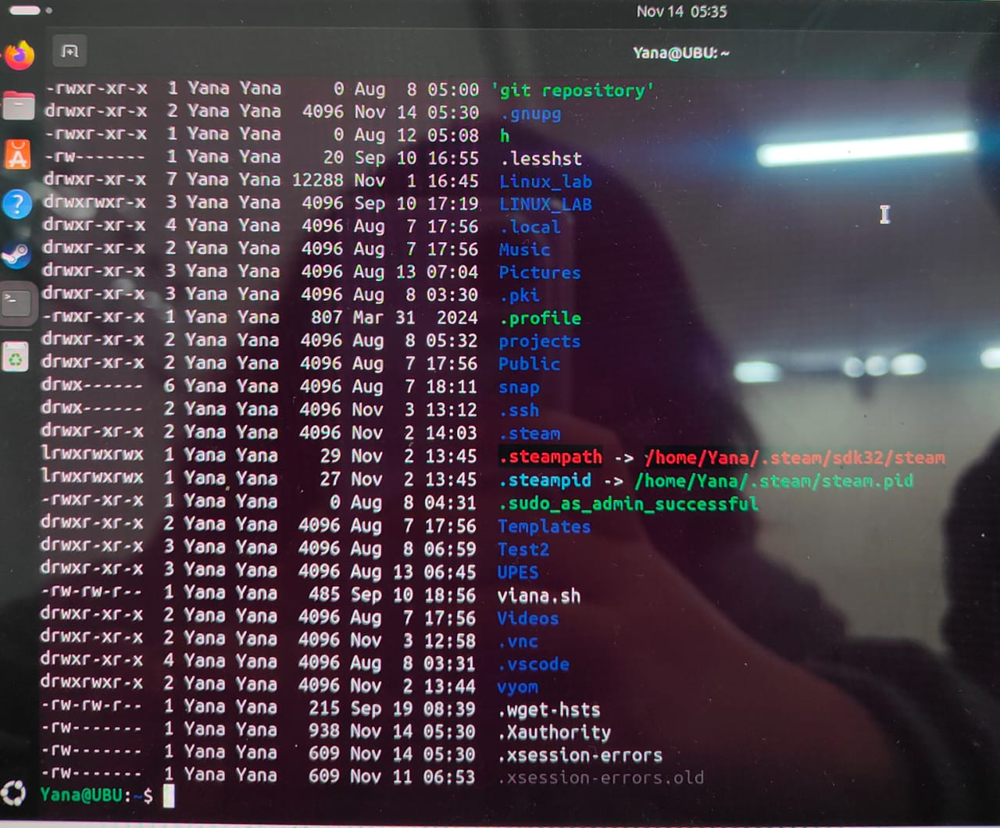
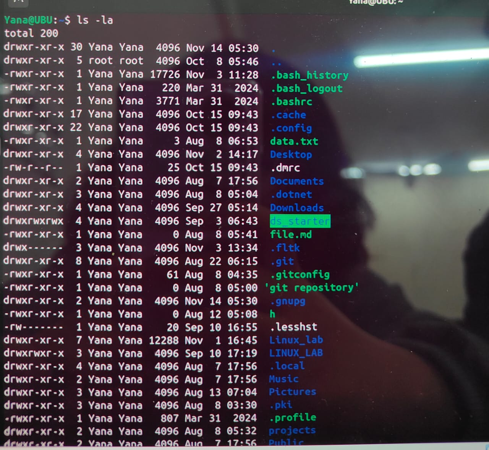
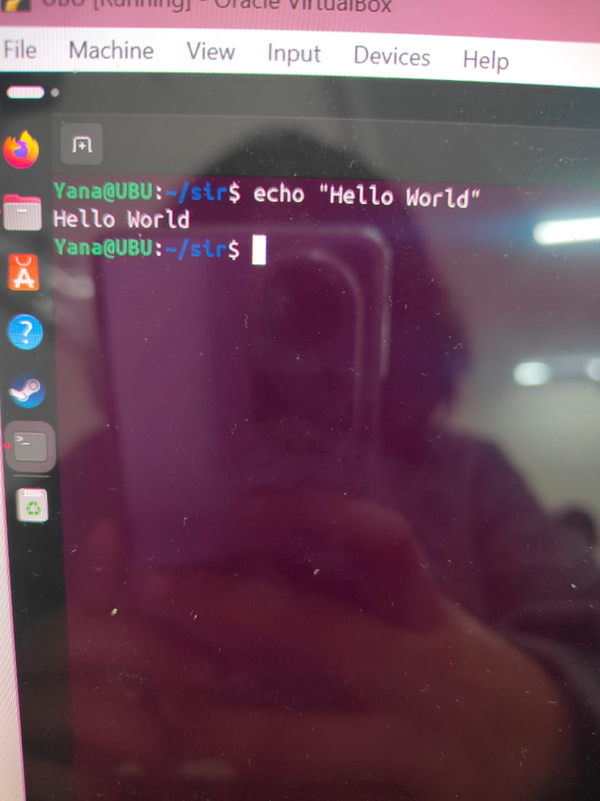
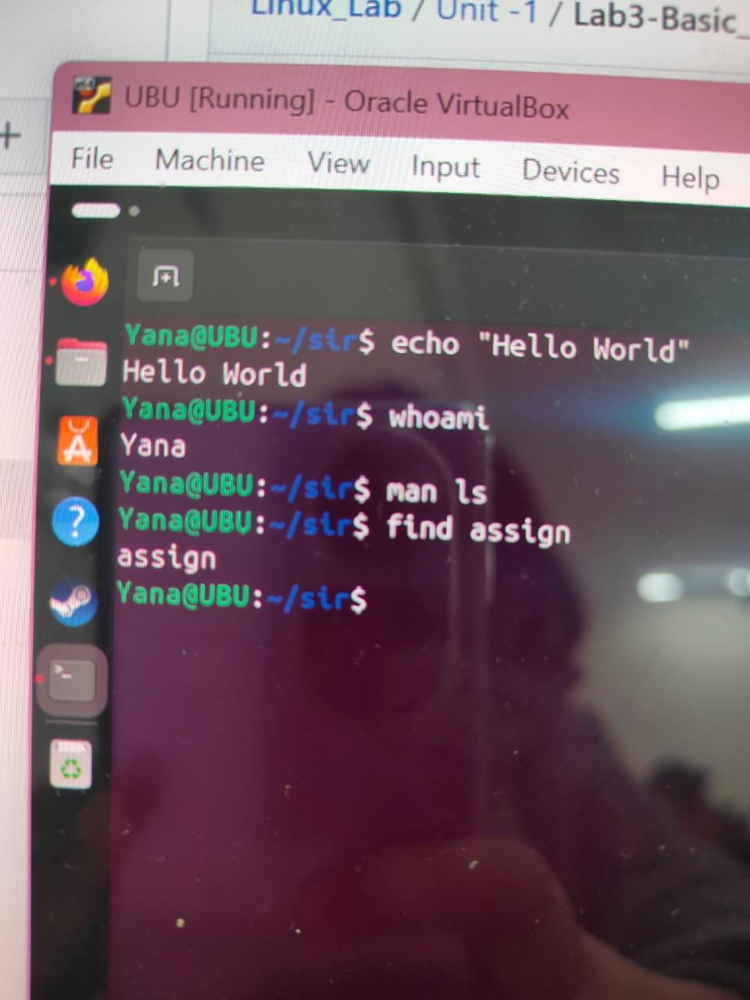

# LINUX BASIC COMMANDS
## 1. Navigation Commands
### `pwd` – Print Working Directory
Shows the current location in the filesystem.
>pwd

Output example:
>/Users/Yana/projects



### ls – List Directory Contents
Lists files and folders in the current directory.
>ls

   * ls -l → Detailed list (permissions, size, date)
   * ls -a → Shows hidden files (those starting with .)
   * ls -la → Combined

Output :
   

### `cd` – Change Directory
Moves into a directory.
>cd folder_name

Examples:
>cd Documents        # Go to Documents\
cd ..               # Go up one level\
cd /                # Go to root\
cd ~                # Go to home directory

Output:


## 2. File and Directory Management
### `mkdir` – Make Directory
Creates a new folder.
>mkdir new_folder

Output:


### `touch` – Create File
Creates an empty file.
>touch file.txt


### `cp` – Copy Files or Directories

```bash
cp source.txt destination.txt
```

* Copy folder:


```bash
cp -r folder1 folder2
```

---

### `mv` – Move or Rename Files

```bash
mv oldname.txt newname.txt
```

```bash
mv file.txt ~/Documents/     # Move file
```

---

### `rm` – Remove Files

```bash
rm file.txt          # Delete file
rm -r folder_name    # Delete folder (recursively)
```

⚠️ **Be careful!** There is no undo.

---

## ✅ 3. File Viewing & Editing

### `cat` – View File Contents

Displays content in terminal.

```bash
cat file.txt
```

---

### `nano` – Edit Files in Terminal

A basic terminal-based text editor.

```bash
nano file.txt
```

* Use arrows to move
* `CTRL + O` to save
* `CTRL + X` to exit

---

### `clear` – Clears the Terminal

```bash
clear
```

Shortcut: `CTRL + L`

---

## ✅ 4. System Commands

### `echo` – Print Text

Useful for debugging or scripting.

```bash
echo "Hello, World!"
```

---

### `whoami` – Show Current User

```bash
whoami
```

---

### `man` – Manual for Any Command

```bash
man ls
```

Use `q` to quit the manual.

---

## ✅ 5. Searching and Finding

### `find` – Locate Files

```bash
find . -name "*.txt"
```

🔍 Finds all `.txt` files in current folder and subfolders.

---

### `grep` – Search Inside Files

```bash
grep "hello" file.txt
```

🔍 Searches for the word `hello` inside `file.txt`.

---

## ✅ 6. Helpful Shortcuts

| Shortcut   | Action                      |
| ---------- | --------------------------- |
| `Tab`      | Auto-complete files/folders |
| `↑ / ↓`    | Browse command history      |
| `CTRL + C` | Stop a running command      |
| `CTRL + L` | Clear screen                |

---

## ✅ 7. Bonus: Chaining Commands

* **Run multiple commands**:

```bash
mkdir test && cd test && touch hello.txt
```

* **Run only if previous command succeeds**: `&&`
* **Run regardless of success**: `;`

---


