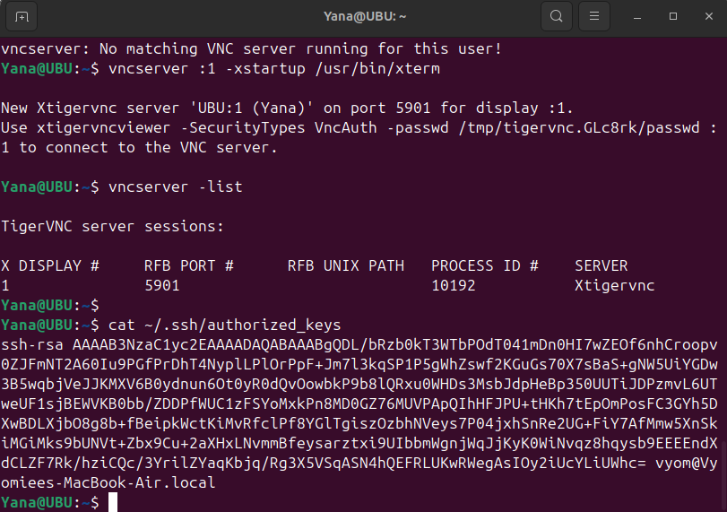
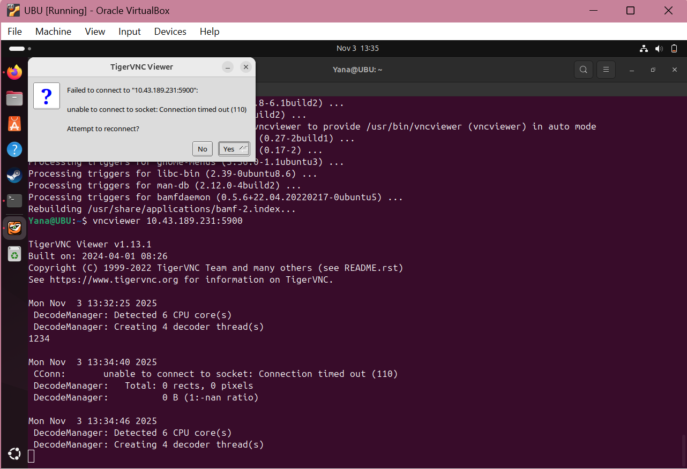
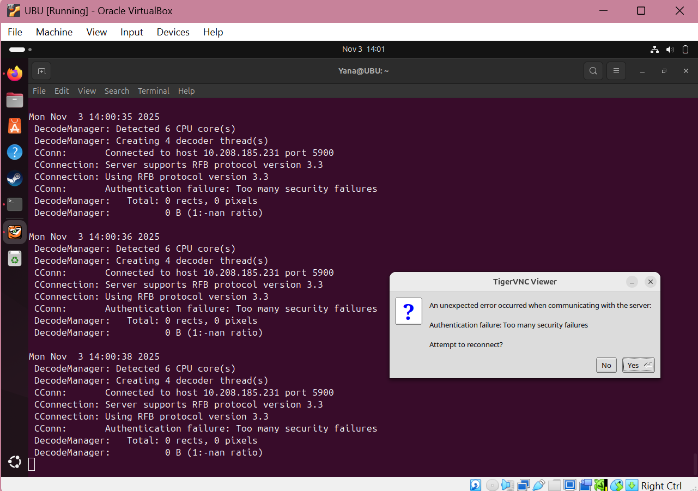

# 🖥️ Secure GUI Access Between Two Linux Machines Using SSH (X11 & VNC)
Goal:
To securely access and control a friend’s Linux laptop (remote machine) from your own laptop (local machine) using SSH encryption. You will enable both X11 forwarding (for individual GUI apps) and VNC over SSH tunneling (for full desktop sharing).

This ensures privacy, authentication, and encryption — unlike plain remote desktop setups.
# Step 1: Prepare and Secure the Remote Machine
(Run these commands on your friend’s laptop)
## 1.1 Install Required Packages
>sudo apt update && sudo apt install -y openssh-server tigervnc-standalone-server

Explanation:
   * `openssh-server`: Enables secure remote login via SSH.

   * `tigervnc-standalone-server`: Optional, provides graphical desktop access via VNC protocol.

   * `apt update`: Updates package lists.

   * `apt install`: Installs the required software packages.

This ensures the friend’s system can accept incoming SSH connections and run a GUI desktop remotely.
## 1.2 Create a Secure User and Enable SSH Service
>sudo useradd -m frienduser || true\
sudo systemctl enable --now ssh

Explanation:
   * `useradd -m frienduser`: Creates a non-root user with a home directory (`/home/frienduser`).

     * Using a non-root user improves security — it limits system-wide access.

   * `systemctl enable --now ssh`: Starts the SSH service immediately and ensures it auto-starts on boot.

Verification:
Run:
>systemctl status ssh

If you see “active (running)”, SSH is successfully enabled.
## 1.3 Set Up SSH Key Authentication
Instead of passwords, use public-key authentication for stronger security
>mkdir -p /home/frienduser/.ssh\
echo "<your-pubkey>" >> /home/frienduser/.ssh/authorized_keys\
chmod 700 /home/frienduser/.ssh\
chmod 600 /home/frienduser/.ssh/authorized_keys\
chown -R frienduser:frienduser /home/frienduser/.ssh

Explanation:
   * `mkdir -p`: Creates the .ssh directory if it doesn’t exist.

   * `authorized_keys`: Stores trusted public keys.

   * `chmod commands`: Secure permissions — only the owner can read/write.

   * `chown`: Ensures correct ownership.

This setup allows your laptop to connect via SSH without entering a password each time, using your private key for authentication.
# Step 2: Connect and Test X11 Forwarding (Single GUI Application)
## 2.1 Connect via SSH with X11 Enabled
>ssh -p 22 -X frienduser@FRIEND_IP

Explanation:
   * `ssh`: Secure Shell client for encrypted connections.

   * `-X`: Enables X11 forwarding, which securely sends graphical output from the remote system to your local display.

   * `FRIEND_IP`: The IP address of your friend’s laptop.

   * `-p 22`: Specifies the default SSH port (22).`

You are now securely logged into the remote system.
## 2.2 Test GUI Application
Once connected, run a simple graphical application:
>xeyes &

Or
>gedit &

Explanation:
   * The application runs on the remote machine, but its GUI window appears on your local laptop.

   * The ampersand `&` allows it to run in the background.

Success Criteria:
   * The GUI window (like xeyes or gedit) appears on your laptop screen.

   * It responds to mouse/keyboard actions smoothly.

If it works — X11 forwarding is correctly configured and secure.
# Step 3: Set Up VNC Over SSH (Full Remote Desktop)
Sometimes you need access to the full remote desktop instead of a single application. This can be done securely with VNC over SSH tunneling.
## 3.1 Start the VNC Server on the Remote Laptop
>vncserver :1

Explanation:
   * Starts a VNC session on display `:1`.

   * The corresponding port is `5900 + display_number` → `5901`.

   * It launches a desktop environment you can connect to remotely.

You can stop it by using
>vncserver -kill :1

## 3.2 Create an Encrypted SSH Tunnel from Your Laptop
>ssh -L 5901:localhost:5901 -p 22 frienduser@FRIEND_IP -N &

Explanation:
   * `-L 5901:localhost:5901`: Forwards local port 5901 on your laptop to remote port 5901 on your friend’s machine through SSH.

   * `-N`: Does not execute remote commands — only creates the tunnel.

   * `&`: Runs it in the background.

This ensures all VNC data travels encrypted through SSH, preventing eavesdropping.
## 3.3 Connect Using a VNC Viewer
Open your local VNC Viewer application (such as TigerVNC, Remmina, or RealVNC) and connect to:
>localhost:5901

Explanation:\
The connection first goes to your local machine’s port 5901, which is securely tunneled to the friend’s VNC server on their laptop.
## Success Criteria:
   * A full remote desktop appears on your screen.

   * You can use the keyboard and mouse, open windows, and transfer clipboard text.

   * The session is encrypted end-to-end through SSH.

# Security Overview
| Security Layer                  | Description                                            |
| ------------------------------- | ------------------------------------------------------ |
| **SSH Encryption**              | Ensures all network traffic (X11 or VNC) is encrypted. |
| **Public-Key Authentication**   | Prevents brute-force password attacks.                 |
| **Non-root User**               | Minimizes system-level security risks.                 |
| **Firewall Control (optional)** | You may open only port 22 for SSH and block others.    |

# Troubleshooting Tips
| Issue                         | Possible Fix                                                                                   |
| ----------------------------- | ---------------------------------------------------------------------------------------------- |
| GUI apps fail to open         | Ensure X11 forwarding is enabled in `/etc/ssh/sshd_config` (`X11Forwarding yes`). Restart SSH. |
| VNC Viewer shows black screen | Ensure a desktop environment (like XFCE or GNOME) is installed on remote machine.              |
| SSH connection refused        | Check `sudo systemctl status ssh` or open port 22 in the firewall (`sudo ufw allow ssh`).      |
| Laggy VNC                     | Lower resolution or color depth in VNC settings.                                               |

# Summary of Commands
| Task                | Command (Run Location)                                                  | Purpose                                   |
| ------------------- | ----------------------------------------------------------------------- | ----------------------------------------- |
| Install SSH & VNC   | `sudo apt install openssh-server tigervnc-standalone-server` *(remote)* | Enable secure and graphical remote access |
| Enable SSH service  | `sudo systemctl enable --now ssh` *(remote)*                            | Start SSH server                          |
| Set SSH key         | Add public key to `~/.ssh/authorized_keys` *(remote)*                   | Enable passwordless authentication        |
| X11 connection      | `ssh -X frienduser@FRIEND_IP` *(local)*                                 | Run GUI apps remotely                     |
| Start VNC           | `vncserver :1` *(remote)*                                               | Start graphical session                   |
| Tunnel VNC over SSH | `ssh -L 5901:localhost:5901 frienduser@FRIEND_IP -N &` *(local)*        | Securely forward VNC                      |
| Connect via VNC     | Open viewer → `localhost:5901` *(local)*                                | Access full remote desktop                |

# Final Outcome
After completing all steps:
   * You have secure, encrypted GUI access to your friend’s laptop.

   * You can run individual graphical applications (X11) or control the entire desktop (VNC).

   * All data transfer occurs through SSH encryption, ensuring both privacy and integrity.

